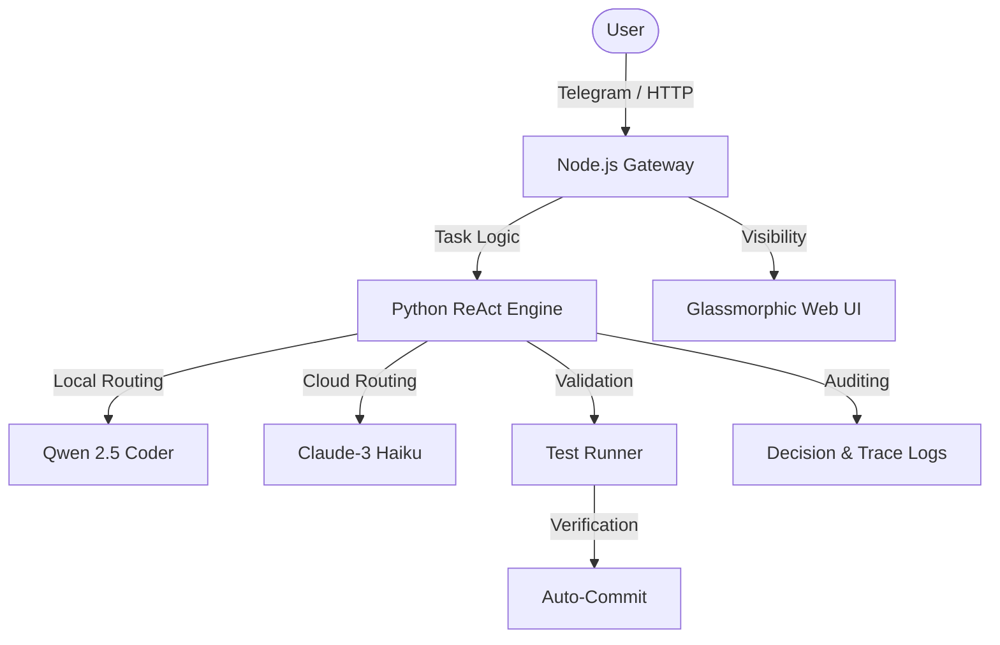

# 🦅 OpenClaw: Enterprise-Grade Autonomous Agent

> **Hybrid Local/Cloud Reasoning | Self-Healing Codebase | Interactive Dashboards**

OpenClaw is a modular autonomous agentic system designed for professional software engineering teams. It automates the entire debugging lifecycle through a multi-agent ReAct architecture, bridging the gap between local privacy and cloud-scale intelligence.

---

## 🏗️ Architecture Diagram


## 📂 Project Structure
```text
openclaw/
├── bot/           # Node.js Telegram & Dashboard Server
├── agent/         # CrewAI Multi-Agent Workflows
├── dashboard/     # Vanilla Glassmorphic UI 
├── logs/          # Persistent Decision & Audit Trails
├── assets/        # Branding & Logos
└── .env.example   # Configuration Template
```

## 🚀 Key Features

-   **Gateway Routing**: Intelligent switching between **speed/privacy (Local)** and **complex reasoning (Cloud)**.
-   **Skills System**: Fine-grained commands including `/analyze` (Deep Reviews) and `/explain` (Educational Walkthroughs).
-   **Confidence Gate**: Automated Git commits triggered only upon verified passing test coverage (>80%).
-   **Decision Logging**: Persistent tracking of autonomous choices and reasoning paths.
-   **Glassmorphic UX**: A real-time web dashboard providing a 10,000ft view of your AI development team.

## 🛠️ Quick Start

1. **Configure**: `cp .env.example .env` and add your OpenRouter key.
2. **Boot**: Run `node bot/bot.js` from the `openclaw` root.
3. **Control**: Open Telegram or Navigate to `http://localhost:3000`.

---
*Built with ❤️ for the future of Autonomous Debugging.*
